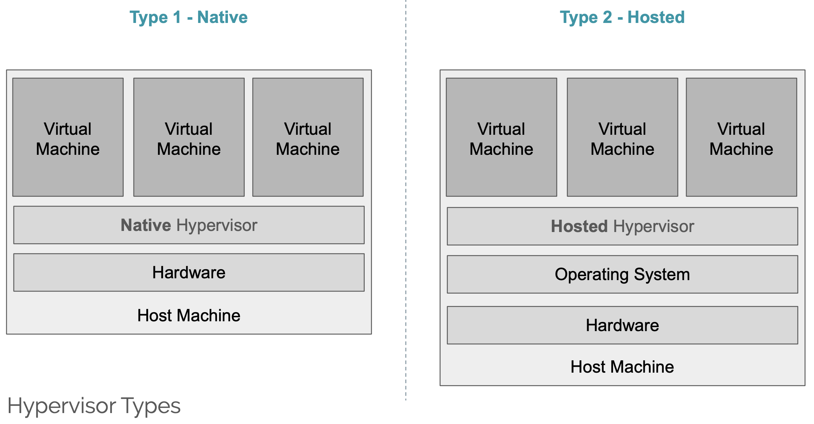
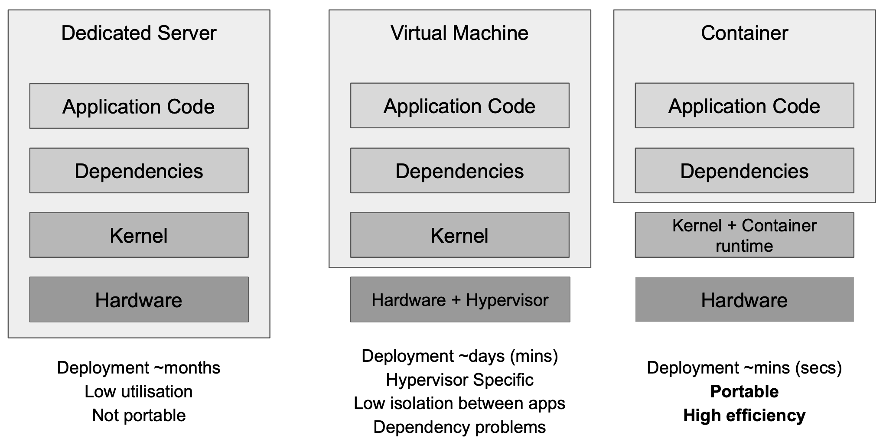

## Index

[TOC]

## Overview

- Data Analysis
  - Batch processing
    - **MapReduce**/Hadoop [ppt](./exc-materials/02-MapReduce-2019.pdf) [ppt+](./exc-materials/other_ppt/map-reduce.ppt)  [paper](./exc-materials/extreme computing Paper/MapReduce.pdf)
    - Spark(Guest)
  - Stream processing
    - Spark processing(Guest)
    - Flink
  - Graph porcessing
    - **Pregel**/Graph
    - GraphX
  - Query processing
    - **Pig** or HIVE [ppt](./exc-materials/03-Apache-Pig-2019.pdf) [ppt+](./exc-materials/other_ppt/Pig.pdf)
  - Machine Learning
    - Tensorflow(Guest)
- Data Management
  - File-system
    - **GFS/HDFS**
  - Distributed database
    - **BigTable/Hbase**
    - Spanner
- Resource Management
  - Cluster manager
    
    - Mesos/YARN
  - Co-ordination service
    
    - **ZooKeeper/Chubby**
  - Infrastructure
    
    - **VMs/Containers**  [VM](./exc-materials/08-Virtualisation.pdf) [Container](./exc-materials/09-Containers.pdf)
    
      


##MapReduce

> **MapReduce** is a [programming model](https://en.wikipedia.org/wiki/Programming_model) and an associated implementation for processing and generating [big data](https://en.wikipedia.org/wiki/Big_data) sets with a [parallel](https://en.wikipedia.org/wiki/Parallel_computing), [distributed](https://en.wikipedia.org/wiki/Distributed_computing) algorithm on a [cluster](https://en.wikipedia.org/wiki/Cluster_(computing)).

### programming model


- 初始化工作：切分数据、创建作业；JobTracker负责调度(Hadoop1.0)

- **Partitions**:  字面意思，不同的partition会被transmit到不同的reducer

- **Spill**:  把内存缓冲区中的数据写入到**Local disk**，在写入本地磁盘时先按照partition、再按照key进行排序（quick sort);

  - map输出数据根据partition、key sort后，可以在写入文件之前执行一次**combiner**操作;

- **Merge**:  一个mapper只输出一个文件，所以需要merge多个spill_file

  - **多路归并排序**
  - 分区索引文件，记录每个分区数据的起始位置，长度以及压缩长度

- **第二个Merge**:  reducer从多个mapper copy数据到内存，达到阈值后merge；无sort

- **最后的Merge**:  合并到一个输入文件

  ---

- 相同的key**一定**被hash到同一个reducer；

- reducer的input是**有序**的(e.g. 相同key的输入紧连着)

> [MapReduce之Shuffle过程详述](https://matt33.com/2016/03/02/hadoop-shuffle/)


### Review assignment TODO

- Review task1-4


### System Design

> Scheduling, fault tolerance, etc

#### Scheduling

- jobtracker(master)会跟踪machine的状态（idle，in-progress，completed），方便调度
- backup(Redundant Execution)
  - 一些machine（straggler）在剩几个tasks时候卡住了，solution：backup executions of the remaining **in-progress** tasks. The task is marked as completed whenever either the primary or the backup execution completes. (让其他machine同时执行剩下的tasks)
- 为了减少network overhead
  - task split 64MB(GFS的block size)
  - map reduce靠近input data（same machine 或者 same rack）
- Skip bad Records
  - 向master报告fail的input，如果master多次收到同样的signal，则skip record

#### straggler mitigation

> what's straggler?  a machine that takes an unusually long time to complete one of the last few map or reduce tasks in the computation

- Solution: backup

#### Fault tolerance

- On worker failure:

  - Detect failure via periodic **heartbeats**

    Re-execute **completed** and **in-progress** *map* tasks。 因为**store on local disk**

    Re-execute **in progress** *reduce* tasks。 因为**store in gobal file sys**

    Task completion committed through master

- Master failure
  
  - write periodic **checkpoints**
  
  

## Apache Pig

> Pig是一个基于Apache Hadoop的大规模数据分析平台，它提供的SQL-LIKE语言叫Pig Latin，该语言的编译器会把类SQL的数据分析请求转换为一系列经过优化处理的MapReduce运算

### Programming Model

- Run locally

> 下载Apache Ant二进制文件，并在 **~/.bash_profile** 中配置Ant的环境变量；
>
> 同理，配置Pig的环境变量
>
> pig -x local 激活grunt交互式
>
> pig -x local file

- 分号！分号！分号！分号！分号！分号！分号！分号！分号！

- 声明UDF(User Defined Function)————> Register；
  - UDF常用来pre-process & clean data

使用Python写UDF：

```
Register 'somefile.py' using jython as myfuncs;
```

- 典型的udf.py文件： ————>注意 **chararray**！

```
@outputSchema("word:chararray")
def helloworld():  
  return 'Hello, World'

@outputSchema("word:chararray,num:long")
def complex(word):
  return str(word),len(word)

@outputSchemaFunction("squareSchema")
def square(num):
  return ((num)*(num))

@schemaFunction("squareSchema")
def squareSchema(input):
  return input

# No decorator - bytearray
def concat(str):
  return str+str
```

`@outputSchema()`的作用是方便Pig知道output的specific form

- 使用：

```
b = foreach a generate myfuncs.helloworld(), myfuncs.square(3);
```

- Load/store   e.g.

**PigStorage()** 将数据加载并存储为结构化文本文件。它采用分隔符，使用它来将元组的每个实体分隔为一个参数。默认情况下，以**'\t'**作为参数；

PigStorage也可以存数据，和**STORE** INTO 搭配使用；

```
raw = LOAD 'excite.log' USING PigStorage('\t') AS (user, time, query);
STORE result INTO 'myOutput';
```

- FILTER BY

```
clean1 = FILTER raw BY myfuncs.NonURLDetector(query);
```

- FOREACH GENERATE  

foreach(行)，generate(列)

```
clean2 = FOREACH clean1 GENERATE user, time, myfuncs.ToLower(query) as query;
```

- GROUP

> 把相同key的data打包在一起，result有两列，1st是key，2nd是一个bag(Pig的数据结构)

```
group_data = GROUP student_details by age;
```

- JOIN

> The **JOIN** operator is used to combine records from two or more relations. While performing a join operation, we declare one (or a group of) tuple(s) from each relation, as **keys**. When these **keys match**, the two particular tuples are matched, else the records are dropped. Joins can be of the following types

- Self-join  table自己和自己join，需要alias

- Inner-join  类比“交集”

```
result = JOIN relation1 BY columnname, relation2 BY columnname;
```

e.g.

**customers.txt**

```txt
(id:int, name:chararray, age:int, address:chararray, salary:int)
1,Ramesh,32,Ahmedabad,2000.00
2,Khilan,25,Delhi,1500.00
3,kaushik,23,Kota,2000.00
4,Chaitali,25,Mumbai,6500.00 
5,Hardik,27,Bhopal,8500.00
6,Komal,22,MP,4500.00
7,Muffy,24,Indore,10000.00
```

**orders.txt**

```
(oid:int, date:chararray, customer_id:int, amount:int)
102,2009-10-08 00:00:00,3,3000
100,2009-10-08 00:00:00,3,1500
101,2009-11-20 00:00:00,2,1560
103,2008-05-20 00:00:00,4,2060
```

```
coustomer_orders = JOIN customers BY id, orders BY customer_id;
```

**Output**

```
(2,Khilan,25,Delhi,1500,101,2009-11-20 00:00:00,2,1560)
(3,kaushik,23,Kota,2000,100,2009-10-08 00:00:00,3,1500)
(3,kaushik,23,Kota,2000,102,2009-10-08 00:00:00,3,3000)
(4,Chaitali,25,Mumbai,6500,103,2008-05-20 00:00:00,4,2060)
```

- Outer Join 类比“并集”

  - Left outer join

    > The **left outer Join** operation returns all rows from the left table, even if there are no matches in the right relation.

    ```
    outer_left = JOIN customers BY id LEFT OUTER, orders BY customer_id;
    ```

    ```
    (1,Ramesh,32,Ahmedabad,2000,,,,)
    (2,Khilan,25,Delhi,1500,101,2009-11-20 00:00:00,2,1560)
    (3,kaushik,23,Kota,2000,100,2009-10-08 00:00:00,3,1500)
    (3,kaushik,23,Kota,2000,102,2009-10-08 00:00:00,3,3000)
    (4,Chaitali,25,Mumbai,6500,103,2008-05-20 00:00:00,4,2060)
    (5,Hardik,27,Bhopal,8500,,,,)
    (6,Komal,22,MP,4500,,,,)
    (7,Muffy,24,Indore,10000,,,,) 
    ```

  - Right outer join

  - full outer join 结果是left、right的 ∪

- DISTINCT

> The **DISTINCT** operator is used to remove redundant (duplicate) tuples from a relation.

- ORDER
  - 用来排序，e.g.

```
ordered_uniq_frequency = ORDER filtered_uniq_frequency BY hour, score;
```


### System Design

- motivation behind designing Pig
  - MapReduce 太 low-level，对于common data analysis tasks
    - 一些常用的高级操作，filter、join、group-by、sort等 re-implementation
  - MapReduce no support to complex N-step dataflow
  - Lacks explicit support for multiple datasets
- system architecture(Pig compiler)
  - Logical plan —Physical Plan — MapReduce Plan


##  Virtualization & Containers   

> **Virtual Machine:** A virtual representation of a physical machine. 
>
> efficiency、fault tolerance、 security、 consolidation(更多合并的意思，VM)

### Terminology

- **Virtual Machine Monitor** or **Hypervisor:**   监管VM的软件
- **Host Machine:** The `physical machine` that a virtual machine is running on.
- **Guest Machine:** The `virtual machine`
- **Trap and Emulate**: is a technique used by the virtual machine to **emulate** `privileged instructions` and registers and pretend to the OS that it's still in `kernel mode`.
- **privileged instructions**:  is an **instruction** (usually in machine code) that can be executed only by the operating system in a specific mode.
- **kernel mode**:   In **Kernel mode**, the executing code has complete and unrestricted access to the underlying hardware. It can execute any CPU instruction and reference any memory address.

### 2 Type of Hypervisor

- **Type 1: Native Hypervisors** run directly on the host machine, and share out resources (such as memory and devices) between guest machines. 
  -  e.g. XEN, Oracle VM Server 

- **Type 2: Hosted Hypervisors** run as an application inside an operating system, and support virtual machines running as individual processes. 
  - e.g. VirtualBox, Parallels Desktop, QEMU



### Types of Virtualisation... And Container!

|             software              | hardware(full system) |       Paravirtualisation       |
| :-------------------------------: | :-------------------: | :----------------------------: |
| emulate(仿真) guest's instruction |  直接在 host CPU执行  |   Co-operate with hypervisor   |
|        Cross-architecture         |   Same-architucture   | 不使用trap执行privileged instr |
|               Slow                |         Fast          |                                |

### Privileged instructions

Host machine，如果在hosted hypervisor下，作为host的一个应用，不能访问一些 Privileged instructions，所以需要其他途径：

- Trap-and-Emulate

  - All privileged instructions `trap` to the `VMM`
  - VMM `emulates` these `privileged operations `

- Code Patching

  - 把host OS的一些privileged instruction用系统调用的方式重写

  - used in `Paravirtualisation`

    

### Container

- why we need container?



- No isolation with kernel, only application and dependencies

- example Docker

---

- Container基于系统（e.g. linux）底层对文件、资源的分割，如chroot cgroup namespace等


